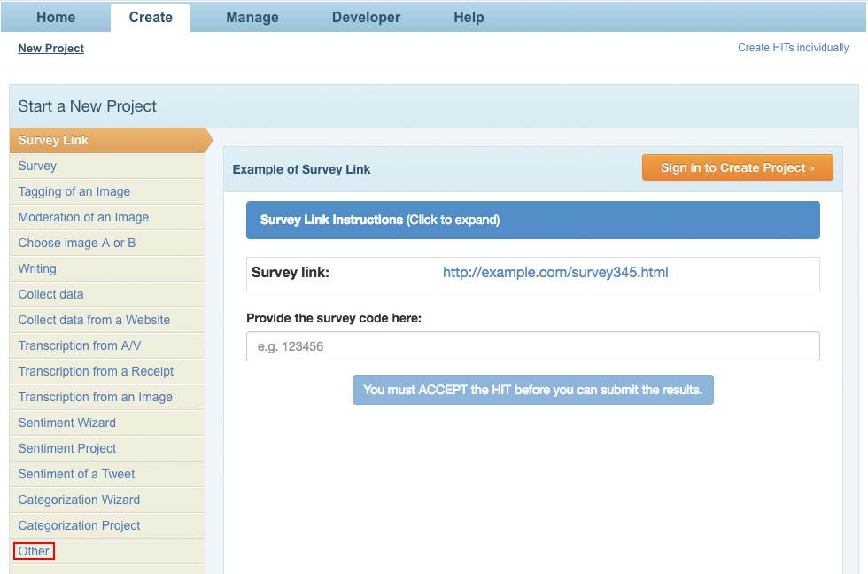

## Checklist for the use of the Qualtrics Survey Platform with Recruitment via MTurk

The following checklist is recommended for all researchers conducting studies using the Qualtrics survey platform, with recruitment via Amazon.com's Mechanical Turk (MTurk). The checklist includes sections on recommendations for pre-planning, design SOPs/checks in both the Qualtrics and MTurk platforms, several stages of testing, and protocols for resolving issues after launching a flawed study.  

The checklist also contains a number of example images and `R` code designed to instruct researchers in streamlining design and establishing optimal practices.

1. *Pre-planning: all survey experiments to be carried out in Qualtrics using MTurk should first proceed through the following pre-planning stages.*
    1. Presentation/discussion -- a draft of the survey instrument(s) should be presented to a senior colleague or professor with experience running surveys in Qualtrics using MTurk
            1. When conducting research as part of a research lab, drafts should be presented before the lab, with PI(s) present
 2. IRB exemption/approval -- following presentation or workshopping, the amended instrument(s) must receive IRB exemption/approval
            1. For research conducted with coauthors affiliated with separate institutions, researchers must receive IRB exemption/approval from each institution
    3. Pre-analysis plan -- the exempt/approved project must be detailed in a pre-analysis plan to be hosted online prior to the collection of any data
2. *Qualtrics design: the survey, hosted via a Secure Qualtrics platform, must satisfy the following design requirements and checks before it can be launched.*
    1. Independent confirmation -- prior to "alpha testing" (conducted with research assistants; or lab members, if conducting research as part of a research lab), the primary researcher(s) must confirm that the survey satisfies the following requirements, and that the following features are properly designed
        1. Basic proofreading and language requirements
            1. Complete thorough spelling and grammar checks
            2. Ensure that questions are worded appropriately, succinctly, and understandably
            3. Ensure that questions aim at the proper inferential target
            4. Ensure that question answer choices measure outcomes appropriately and succinctly
            5. Ensure that questions are formatted efficiently and readably, and reformat where appropriate (e.g., by condensing separate questions into a Matrix Table format)
            6. For all cases in which a clear solution to problems presented by items b - e in Section 2.i.a. is unavailable, the primary researcher(s) may proceed according to the following approaches
                * Consult the established literature in the field for proper terminology or questions of interest
                * Consult colleagues and professors
                * Exploit randomization to assess the relevance of multiple options
        2. Proper Survey Flow
            1. Randomization
                * Do *not* select "Evenly Present Elements"
                * *Do* ensure that the Randomizer is set to present the correct number of elements to respondents
                  
                * Ensure that other design features (e.g., branching) remain constant across randomized arms, where appropriate
            2. Branching
                * Ensure that branching is specified correctly (e.g., conditioned on the correct question/answer choice pair(s), embedded data, and randomization)
                     * In the case of random assignment into a given treatment arm via branching, ensure that respondent views the only relevant arm(s); ensure that branching does not prevent all arms sequentially
            3. Embedded data
                * Set embedded data at the beginning of the survey flow (i.e., prior to all other Survey Flow elements, *except* for the Web Service element that generates end-of-survey confirmation codes)
                * Confirm that terms are defined properly within the Survey Flow (e.g., that piped text is formatted adequately and grammatically correct)
                * When using piped text, confirm that terms are "called" correctly within the relevant survey question text
                * Where appropriate, confirm that embedded data selection is properly randomized (see Section 2.i.b.a.)
            4. End-of-Survey logic
                * Ensure that End of Survey logic is altered appropriately to present an end-of-survey confirmation code to respondents who complete the survey as given
                * Ensure that the End of Survey logic is altered appropriately to exclude an end-of-survey confirmation code for respondents do not meet recruitment requirements (e.g., consent, age, etc.)
        3. Miscellaneous survey features and settings
            1. A consent form *must* be included as the first question
            2. An end-of-survey message containing a randomized confirmation code *must* be specified in the survey (see Section 2.i.b.d.)
                * An end-of-survey confirmation code can be generated using a Web Service element, as below
                
                * Ensure that a generated confirmation code is only presented to respondents who meet recruitment requirements and complete the survey as given (the default end-of-survey message may be employed for respondents who do not meet the recruitment requirements)
                * This message must be written and stored in the Qualtrics Library, and specified in Survey Options, as below
                
                * Ensure that the Embedded Data term "called" in the Web Service element matches that defined in the message written and stored in the Qualtrics Library (see above image)
            3. Anonymization
                * Survey responses must be anonymized in accordance with IRB exemption/approval
                * Responses can be anonymized by checking the appropriate box in Survey Options &rarr; Survey Protection, as below
                
            4. "Covariate" questions
                * For all "covariate" questions with appropriate analogues in the ANES/MTurkES survey instrument, use the ANES/MTurkES specification
                    * The MTurkES specification is recommended, as it was specifically designed for use on Qualtrics and MTurk
            5. Follow-up surveys
                * Follow-up surveys *must* include either or both of the following elements, in confirmed working order
                    * An IRB-exempt/approved question or questions for matching respondents between waves
                    * Data collection enabling matching between waves (e.g., via Qualtrics confirmation code)
            6. Validation
                * Ensure that each question features appropriate validation using Validation Options (e.g., Request Response, or Custom Validation for various input formats)
                    * Validation options can be selected on the right pane containing question options, after selecting a given question in the Qualtrics platform
	    7. Images
	    	* Images (e.g., graphical treatments) to be used in conjunction with, or in lieu of, question text must first be added to the Qualtrics Graphics Library, accessible by clicking Library &rarr; Graphics Library
		    * Images can be uploaded to the Graphics Library by clicking the Upload Graphic button
		* Once uploaded to the Graphics Library, images can be embedded in questions by opening the Rich Content Editor, and clicking the Insert Graphic button, as shown below
		
		* Ensure that all included images (in particular, textual images) satisfy the requirements enumerated in Section 2.i.a.
    2. Alpha testing -- prior to "beta testing" with research assistants (or lab members, if conducting research as part of a research lab), the survey must be "alpha tested" in its entirety both using the Preview Survey functionality, and with recorded responses (using the Anonymous Link for web distribution)
        1. Independent testing (Preview Survey)
            1. Complete thorough independent testing procedures through the Qualtrics Preview Survey functionality; ensure that the survey contains stable, functioning elements as detailed in Section 2.i.
                * Ensure that elements function as intended by utilizing Test Responses; these can be generated by accessing Tools &rarr; Test Survey... in the Qualtrics platform
        2. Research-assistant testing (Preview Survey)
            1. Share survey with research assistants for a full, thorough review of instrument text and Survey Flow (including all survey elements)
                * Research assistants must be granted full access to the survey in order to review all elements and full Survey Flow; the primary researcher(s) may therefore choose to copy the survey prior to sharing to research assistants, to avoid accidental changes or errors
            2. Ensure that research assistants complete a full, thorough review of the survey via the Preview Survey functionality
            3. The survey should contain stable, functioning elements as detailed in Section 2.i.
        3. Independent testing (recorded responses)
            1. After ensuring that the survey functions as intended via a full, thorough review of instrument text, Survey Flow, and function via Preview Survey, generate an Anonymous Link to collect recorded responses
            2. Ensure that survey functionality is maintained with recorded responses
                * Attempt to "break" the survey functionality, especially with conditional embedded data, validation, and input text
                * Examine potential issues and data structure by downloading data via Data & Analysis (using legacy format)
                    * Ensure that elements function as intended by utilizing Test Responses; these can be generated by accessing Tools &rarr; Test Survey... in the Qualtrics platform
        4. Research-assistant testing (recorded responses)
            1. Share the Anonymous Link for recorded responses with research assistants for a full and thorough test of all survey features and functionalities
                * Instruct research assistants to attempt to "break" the survey functionality, especially with conditional embedded data, validation, and input text
                * Examine potential issues and data structure by downloading data via Data & Analysis (using legacy format)
    3. Beta testing -- when conducting research as part of a research lab, surveys must be "beta tested" with lab members using the Anonymous Link for web distribution (following independent and research-assistant "alpha testing")
        1. Instruct lab members to attempt to "break" the survey functionality, especially with conditional embedded data, validation, and input text
        2. Where employing randomization, request that lab members record which treatment(s) they receive, to confirm proper randomization pursuant to evaluations using Test Responses
        3. Examine potential issues and data structure by downloading data via Data & Analysis (using legacy format)
3. *MTurk HIT specification: once the Qualtrics survey is in concordance with the checklist items enumerated in Section 2., an MTurk HIT must be created and designed appropriately.*
    1. Create a new HIT
        1. Navigate to the "Create" tab at the navigation bar at the top of the MTurk Requester page
        2. If not employing an MTurk default format, select "Other" from the format list on the left; then select "Create Project"
	
        3. Specify requirements for "Describe your HIT to Workers"
	
            1. Specify a "HIT Title"
            2. Specify a short "HIT description"
            3. Specify appropriate "Keywords" pertaining to the HIT
        4. Specify requirements for "Setting up your HIT"
	
            1. Specify "Reward per assignment" (i.e., the payment rate, per subject)
            2. Specify "Number of assignments per HIT" (for a survey or survey experiment, this will correspond to the number of subjects to be recruited for the pilot or study---see Section 4.i. for further details; $.50/5 minutes is recommended)
            1. Specify "Time allotted per assignment" (1 Hours is recommended as a default)
            2. Specify time for "HIT expires in" (5 Days is recommended as a default)
            3. Specify time for "Auto-approve and pay Workers in" (8 Hours is recommended as a default)
        5. Specify "Worker requirements"
	
            1. *Do not* "Require that Workers be Masters to do your HITs
                * Masters are not required for quality tasks, but cost appreciably more than standard MTurk workers
            2. "Specify any additional qualifications Workers must meet to work on your HITs" (up to five may be set)
                * Set "Location is UNITED STATES (US)," or other location as appropriate and exempt/approved by IRB
                * "HIT Approval Rate (%) for all Requesters' HITs greater than or equal to 95," or a different threshold as appropriate for the task (a higher HIT Approval Rate is recommended for higher-quality responses)
                * "Number of HITs Approved" to "greater than or equal to 50"
                * Specify whether the "Project contains adult content"
                * Set "HIT Visibility" to "Hidden" - Only Workers that meet my HIT Qualification requirements can see and preview my HITs
            3. For follow-up Surveys
                * Remove "HIT Approval Rate" and "Number of HITs Approved" qualifications
                * Include additional qualification type based on Worker ID collected in the preceding wave(s)
                    * Qualifications can be assigned using `MTurkR`, which may also be used to recontact workers; first install and load the `MTurkR` package
                    
                    ```r
                    install.packages("devtools")
                    library(devtools)
                    install_github(repo="MTurkR", username = "leeper")
                    
                    library(MturkR)
                    ```
                    
                    Then, specify the vector of unique IDs to be used for recontacting respondents to the preceding wave(s)
                    
                    ```r
                    outcome <- rnorm(100)
                    respondent_id <- paste(sample(c(0:9, LETTERS), 6), collapse = "")
                    
                    prior_wave_data <-
                        data.frame(outcome = outcome,
                                   respondent_id = respondent_id)
                                   
                    recontact_ids <- prior_wave_data$respondent_id
                    ```
                    
                    Next, provide your credentials (i.e., your Access Key and Secret Access Key from MTurk
                    
                    ```r
                    access.key <- "EXAMPLEACCESSKEY"
                    secret.access.key <- "EXAMPLESECRETACCESSKEY"
                    credentials(c(access.key, secret.access.key))
                    ```
                    
                    Generate a Qualification Type for the subjects to be recontacted, and assign the qualification type to the relevant workers
                    
                    ```r
                    recontact_qual <-  
                        CreateQualificationType(
                            name = "follow-up_recontacts", status = "Active",
                            description = "Workers from Prior Wave to be Recontacted",
                            keywords = "")
                            
                    recontact_assign_out <-
                        AssignQualification(qual = recontact_qual$QualificationTypeId, 
                                            workers = recontact_ids)
                    ```
                    
                    After specifying that workers must have been given this qualification type in MTurk, `MTurkR` can also be used to notify the relevant respondents about the follow-up survey via email
                    
                    ```r
                    email.subject <- paste("Example Email Subject here")
                    email.message <- 
                        paste("Hello,", 
                            paste("Example message reminding respondents to the prior wave(s)",
                                  "about the preceding HIT(s), requesting that they participate in", 
                                  "the following survey, as well.", sep = " "),
                            paste("Include directions regarding how to find the new HIT using a", 
                                  "unique keyword.", sep = " "),
                            sep = "\n\n")
                    
                    recontact_email_out <- ContactWorker(subject = email.subject,
                                                         msgs = email.message,
                                                         workers = recontact_ids,
                                                         batch = TRUE)
                                               
                    table(recontact_email_out$Valid)
                    ```
                    
                    * When recontacting workers, save the recontact output (`recontact_assign_out` and `recontact_email_out`in the above example) and email text (`email.subject` and `email.message` in the above example) with other data files
        6. Specify Design Layout
            1. Paste and format study description into the "Design Layout" editor (the appended default format is recommended; click the "Source" button and paste the entirety of the below HTML code into the editor)
            2. Ensure that the Anonymous survey link URL directs subjects to the correct, live survey via the Anonymous Link noted in Sections 2.ii.c. - 2.iii.
            1. Ensure that respondents can specify the end-of-survey random confirmation code provided to subjects who complete the Qualtrics survey
4. *Launching the HIT: once the checklist items enumerated in Section 2., as well as the design specifications enumerated in Section 3. are fulfilled, the MTurk HIT can be created to recruit and pay subjects.*
    1. Piloting -- the HIT *must* first be launched as a pilot study, including no fewer than 20 subjects recruited from MTurk, to ensure proper functionality in both MTurk and Qualtrics prior to distribution using a full sample
        1. Navigate back to the "Create" tab at the navigation bar at the top of the MTurk Requester page
        2. Select "Publish Batch" to the left of the relevant "Project"
        3. On the "Preview" page, confirm the following
            1. Confirm the accuracy of the Reward, HITs available, Duration, and Qualifications listed at the top of the page
            2. Confirm the format of the ``HIT Preview,'' and the accuracy of the Anonymous Link and survey code text box
        4. On the "Confirm and Publish" page, confirm the following
            1. Confirm the accuracy of the Batch Properties
            2. Confirm the accuracy of the HITs specifics
            3. Confirm the accuracy of the Cost Summary
            4. Confirm the accuracy and sufficiency of Payment
                * Confirm the accuracy of the Payment Method
                * Where appropriate, if using funds from an external source (e.g., from a faculty research account), confirm the status of the HIT and Qualtrics survey prior to the transfer of relevant funds
                    * Funds should match the quoted Balance Due exactly
            5. Once all aspects of the HIT are confirmed, select "Purchase & Publish"; the HIT's progress may now be monitored by navigating to the "Manage" tab at the navigation bar at the top of the MTurk Requester page
        5. Confirm the validity of the pilot study using Qualtrics and MTurk data (the latter of which can be accessed via Manage &rarr; Results) and potential MTurker feedback, and correct any remaining errors
    2. Full distribution -- once the pilot study has been completed and accuracy of all design elements and data are confirmed, the study may be distributed to the entire subject pool
        1. Given a flawless pilot study, launch the HIT following the relevant instructions in Section 4.i., on *n* - *k* subjects, where *n* refers to the total number of subjects targeted for the study, and *k* refers to the number of subjects included in the pilot
            1. Subjects from the pilot stage must be excluded using a new qualification type (which can be assigned in `MTurkR`)
        2. Given the unlikely possibility of a problematic pilot study, the researcher must correct all apparent errors; depending on the severity, the researcher may choose to proceed according to one of the following approaches
            1. Re-pilot the study, using a separate pilot group
            2. Proceed according to Section 4.ii.a
            3. Proceed by relaunching the HIT with *n* subjects
                * The relaunched HIT should exclude the *k* subjects from the flawed pilot study

## Appendix

### MTurk HIT default format HTML code
Below is the recommended default format for an MTurk HIT for survey research; note that the format is adapted from an MTurk template:

```html
<!-- For help on using this template, see the blog post: http://mechanicalturk.typepad.com/blog/2014/04/
editing-the-survey-link-project-template-in-the-ui.html --><!-- Bootstrap v3.0.3 -->
<!DOCTYPE html>

<html>
<head>
	<link href="https://s3.amazonaws.com/mturk-public/bs30/css/bootstrap.min.css" rel="stylesheet">

	<title>
	</title>
</head>

<body>
	<section class="container" id="SurveyLink" style=
	"margin-bottom:15px; padding: 10px 10px; font-family: Verdana, Geneva, sans-serif; 
	color:#333333; font-size:0.9em;">
		<div class="row col-xs-12 col-md-12">
			<!-- Instructions -->


			<div class="panel panel-primary">
				<div class="panel-heading">
					<strong>Instructions</strong>
				</div>


				<div class="panel-body">
					<p style="font-family:"><span style="font-size: 14.6667px;"><b>Welcome!&nbsp;Thank you very
					much for your participation in this survey.&nbsp;</b></span><b style=
					"font-size: 14.6667px;">We&#39;re trying to understand &lt;purpose of study
					here&gt;.</b><span style="font-size: 14.6667px;"><b>&nbsp;The survey should take approximately
					&lt;duration here&gt; minutes to complete. Please answer all questions to the best of your
					ability. If you complete this survey, you may be recontacted for a follow-up
					survey.</b></span>
					</p>


					<p style="font-family:">&nbsp;</p>


					<p style="font-family:"><span style="font-weight: 700;"><span style=
					"font-size: 11pt;">Purpose:</span></span>
					</p>


					<p style="font-family:"><span style="font-size: 11pt;">We are conducting a research study on
					&lt;purpose of study here&gt;.</span>
					</p>


					<p style="font-family:"><span style="font-size: 11pt;">&nbsp;</span>
					</p>


					<p style="font-family:"><span style="font-weight: 700;"><span style=
					"font-size: 11pt;">Procedures:</span></span>
					</p>


					<p style="font-family:"><span style="font-size: 11pt;">Participation in this study will
					involve completing a short survey of approximately &lt;duration here&gt;&nbsp;minutes and you
					will receive $&lt;rate here&gt;&nbsp;for your completion of the survey.</span>
					</p>


					<p style="font-family:"><span style="font-size: 11pt;">&nbsp;</span>
					</p>


					<p style="font-family:"><span style="font-weight: 700;"><span style="font-size: 11pt;">Risks
					and Benefits:</span></span>
					</p>


					<p style="font-family:"><span style="font-size: 11pt;">It is unlikely, but possible, that
					participants in this study may experience distress over the nature of the questions. Although
					this study may not benefit you personally, we hope that our results will add to the knowledge
					about &lt;purpose of study here&gt;, and you may leave better informed after the conclusion of
					the study.</span>
					</p>


					<p style="font-family:"><span style="font-size: 11pt;">&nbsp;</span>
					</p>


					<p style="font-family:"><span style="font-weight: 700;"><span style=
					"font-size: 11pt;">Confidentiality</span></span><span style="font-size: 11pt;"></span>
					</p>


					<p style="font-family:"><span style="font-size: 11pt;">All of your responses will be
					anonymous. When we publish any results from this study we will do so in a way that does not
					identify you. We may also share the data with other researchers so that they can check the
					accuracy of our conclusions but will only do so if we are confident that your anonymity is
					protected.</span>
					</p>


					<p style="font-family:"><span style="font-size: 11pt;">&nbsp;</span>
					</p>


					<p style="font-family:"><span style="font-weight: 700;"><span style=
					"font-size: 11pt;">Voluntary Participation:</span></span><span style=
					"font-size: 11pt;"></span>
					</p>


					<p style="font-family:"><span style="font-size: 11pt;">Participation in this study is
					completely voluntary. You are free to decline to participate, to end participation at any time
					for any reason, or to refuse to answer any individual question without penalty.</span>
					</p>


					<p style="font-family:"><span style="font-size: 11pt;">&nbsp;</span>
					</p>


					<p style="font-family:"><span style="font-weight: 700;"><span style=
					"font-size: 11pt;">Questions:</span></span><span style="font-size: 11pt;"></span>
					</p>


					<p style="font-family:"><span style="font-size: 11pt;">If you have any questions about this
					study, you may contact the investigators, &lt;primary pesearcher(s) name(s) here&gt;, at
					&lt;primary researcher(s) email address(es) here&gt;.</span>
					</p>


					<p style="font-family:"><span style="font-size: 11pt;">&nbsp;</span>
					</p>


					<p style="font-family:"><span style="font-size: 11pt;">If you would like to talk with someone
					other than the researchers to discuss problems or concerns, to discuss situations in the event
					that a member of the research team is not available, or to discuss your rights as a research
					participant, you may contact the &lt;relevant IRB information (including name, address, and
					phone number) here&gt;,&nbsp;</span><span style=
					"font-size: 11pt;">relevant IRB email here</span><span style="font-size: 11pt;">. Additional
					information is available at&nbsp;</span><span style="font-size: 11pt;">relevant IRB website
					URL here</span><span style="font-size: 11pt;">.</span>
					</p>
				</div>
			</div>
			<!-- End Instruction -->


			<table>
				<tbody>
					<tr>
						<td><strong>Anonymous survey link:</strong>
						</td>

						<td><span style="color:#0000FF;">Anonymous Link here</span>
						</td>
					</tr>


					<tr>
						<td><strong>Qualtrics end-of-survey completion code here:</strong>
						</td>

						<td style="vertical-align: middle;"><input class="form-control" id="surveycode" name=
						"surveycode" placeholder="e.g. 123456" type="text">
						</td>
					</tr>
				</tbody>
			</table>
		</div>
	</section>
	<!-- close container section -->
	<style type="text/css">
	   td {
	      font-size:1.0em;
	      padding:5px 5px;
	   }
	</style>
</body>
</html>
```

<!--
Additions planned for upcoming versions:
* Include `MTurkR` code to:
    - automatically pay respondents
    - publish the HIT in tranches (automatically)
    - recontact on an individual basis (i.e., assigning one HIT per subject)
* Best practices for working with MTurkers
    - treating MTurkers well (Panopticon)
    - HITs worth Turking for
    - working as a Turker before publishing a HIT
* Best practices for when things go wrong
    - close down the survey?
    - stop running ads?
    - in any/all case(s), be sure to still pay people
-->
