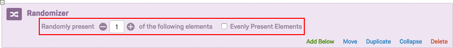
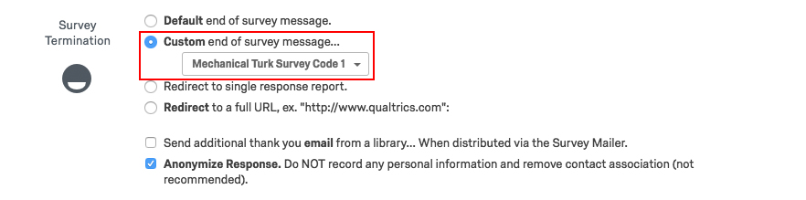
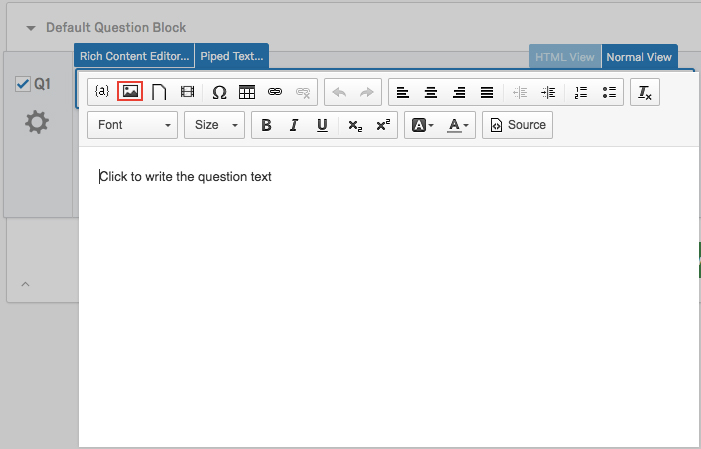

# Using the Qualtrics Survey Platform with Recruitment via MTurk

This document provides recommendations for researchers conducting studies using the Qualtrics survey platform, with recruitment via Amazon Mechanical Turk (MTurk). These recommendations should serve as default practices, and cover pre-planning, design checks in both the Qualtrics and MTurk platforms, several stages of testing, and protocols for resolving issues after launching a flawed study.  

This document also contains a number of example images and `R` code.

## *Pre-planning* 
All survey experiments to be carried out in Qualtrics using MTurk should first proceed through the following pre-planning stages:

### Presentation/discussion.
A draft of the survey instrument(s) should be presented to a senior colleague or professor with experience running surveys in Qualtrics using MTurk. When conducting research as part of a research lab, drafts should be presented before the lab, with PI(s) present
### IRB exemption/approval. 
Following presentation or workshopping, the amended instrument(s) must receive IRB exemption/approval. For research conducted with coauthors affiliated with separate institutions, researchers must receive IRB exemption/approval from each institution.
### Pre-analysis plan. 
Development and archiving of a pre-analysis plan (PAP) prior to data collection is recommended. Online registries include the Evidence in Governance and Politics (EGAP) [registry](http://egap.org/register-your-design) and the American Economic Association's [registry](https://www.socialscienceregistry.org/) for randomized controlled trials (AER RCT). In general, we recommend following the Standard operating procedures for Don Green’s lab at
Columbia (@lin2015standard) for analysis of experiments. 
 
 
    
## *Qualtrics survey design* 
The survey, hosted via a Secure Qualtrics platform, should satisfy the following design requirements and checks before it can be launched: 

### Independent confirmation

This includes basic proofreading as well as language considerations: the survey should be free of spelling and grammar errors, and instructions and questions should be worded succinctly and clearly. Questions should be formatted efficiently and readably; for example, separate questions with the same response options can be condensed in the Matrix Table format. 

The first question must always be a consent form; updated templates for consent forms are available at the website of the [Yale Human Research Protection Program](https://your.yale.edu/research-support/human-research). 
    
For all "covariate" questions with appropriate analogues in the ANES/MTurkES survey instrument, we recommend use of the ANES/MTurkES specification. The MTurkES specification was specifically designed for use on Qualtrics and MTurk. [[citation??]]
    
At this stage, it is essential to ensure that survey questions aim at the appropriate inferential target, and that answer choices allow for clear measurement of the outcome of interest. A PAP may be helpful in determining if this is the case. When in doubt, the research should consult the established literature in the field for proper terminology, as well as with colleagues familiar with the topic. If there is no clear consensus, randomization of question wording or response options may be useful in testing. 


### Survey Flow
#### Randomization. 
When randomizing elements, do *not* select "Evenly Present Elements." This option implements repeated complete random sampling without replacement. Elements are selected for presentation randomly without replacement until each element has been presented once, and this process is then repeated, so that no element can be presented more than one time more than any other element at any time. [[Explain what the problem with this is.]]
        
Meanwhile, *do* ensure that the Randomizer is set to present the correct number of elements to respondents. And ensure that other design features (e.g., branching) remain constant across randomized arms, where appropriate.   

#### Branching. 
Ensure that branching is specified correctly (e.g., conditioned on the correct question/answer choice pair(s), embedded data, and randomization). In the case of random assignment into a given treatment arm via branching, ensure that the respondent views the only relevant arm(s), and  that branching does not present all arms sequentially. 

#### Embedded data. 
When embedded data is randomized, for example to store treatment arm assignment, this should be completed at the beginning of the survey to the extent possible (see the above section on Randomization). End-of-survey confirmation codes are a notable exception. 
     
If piped text is used, the researcher should confirm that the text is formatted adequately and is grammatically correct. 
             
#### Quotas. 
Quotas may not perform as desired when many respondents begin taking the survey at the same time--as is often the case on MTurk--and so we recommend special care when using them. If possible, assignment to treatment arms should be done by randomization and branching, and, if they must be used, quotas should be carefully monitored during survey launch. 
     
#### End-of-survey. 
At each point in the survey when respondents may be deemed ineligible to continue (based on consent, recruitment requirements, etc.), survey flow should direct ineligible respondents to an End-of-survey element. These elements can be customized using stored messages in the Qualtrics Library, so that respondents who end the survey prior to completion are not presented with an end-of-survey confirmation code for entry into MTurk. 


     
End-of-survey confirmation codes can be generated immediately prior to the final End-of-survey element using a Web Service element, as below. 


                
Respondents who complete the survey should then receive an End-of-survey messages such that the confirmation code is piped into the message. Ensure that the Embedded Data term "called" in the Web Service element matches that defined in the message written and stored in the Qualtrics Library (see above image). 


#### Anonymization. 
Survey responses must be anonymized in accordance with IRB exemption/approval. Responses can be anonymized by checking the appropriate box in Survey Options &rarr; Survey Protection, as below.


    
* Follow-up surveys. Follow-up surveys should always include either or both of the following elements, in confirmed working order: 
	* An IRB-exempt/approved question or questions for matching respondents between waves
	* Data collection enabling matching between waves (e.g., via Qualtrics confirmation code)
      
#### Validation. 
Each survey question should feature appropriate validation using Validation Options (e.g., Request Response, or Custom Validation for various input formats). Validation options can be selected on the right pane containing question options, after selecting a given question in the Qualtrics platform. 
     
#### Images. 
Images to be used in conjunction with, or in lieu of, question text should first be added to the Qualtrics Graphics Library, accessible by clicking Library &rarr; Graphics Library. (Images can be uploaded to the Graphics Library by clicking the Upload Graphic button). Once uploaded to the Graphics Library, images can be embedded in questions by opening the Rich Content Editor, and clicking the Insert Graphic button, as shown below. 



#### Survey testing
* Alpha testing. In alpha-testing, all attempts should be made to "break" the survey functionality, especially with conditional embedded data, validation, and input text. 
     
	Each coauthor should test the survey in its entirety using either the Preview Survey functionality or the Anonymous Link for web distribution. Both approaches record survey responses.
   
	If research assistants are collaborating on the project, they should be allowed full access to the survey in order to review the survey instrument and flow. The primary researcher(s) may choose to copy the survey prior to sharing to research assistants, to avoid accidental changes or errors. [[I wonder if we should change this to just say--someone who didn't create the survey should go through taking the survey and looking at the survey flow element by element to make sure it makes sense, whether another co-author or an RA.]

	Test Responses (Tools &rarr; Test Survey) allow for computer-generated responses to all survey questions; depending on the complexity of survey flow and number of treatment arms, researchers may wish to collect twice as many test responses as intended human survey responses (using Test Responses, approximately half will fail the consent question).  
        
	Examine potential issues and data structure by downloading data via Data & Analysis (using legacy format). Ensure that survey flow is functioning properly, and all data necessary for analysis will be collected. 

* Beta testing. When conducting research as part of a research lab, surveys should be "beta tested" with lab members using the Anonymous Link for web distribution. Instruct lab members to also attempt to "break" the survey functionality, especially with conditional embedded data, validation, and input text. When employing randomization, request that lab members record which treatment(s) they receive, to confirm proper randomization pursuant to evaluations using Test Responses. 
     
	Again, examine potential issues and data structure by downloading data via Data & Analysis (using legacy format)
     
     
## *Integration with MTurk*

### MTurk HIT specification

Once the Qualtrics survey is in concordance with the checklist items enumerated in the above sections, an MTurk HIT must be created and designed appropriately.
    
#### Create a new HIT
* Navigate to the "Create" tab at the navigation bar at the top of the MTurk Requester page
    
* If not employing an MTurk default format, select "Other" from the format list on the left; then select "Create Project"


	
* Specify requirements for "Describe your HIT to Workers"

	
            
	1. Specify a "HIT 
	2. Specify a short "HIT description"
	3. Specify appropriate "Keywords" pertaining to the HIT
            
* Specify requirements for "Setting up your HIT"

	
            
	1. Specify "Reward per assignment" (i.e., the payment rate, per subject)
	2. Specify "Number of assignments per HIT" (for a survey or survey experiment, this will correspond to the number of subjects to be recruited for the pilot or study---see Section 4.i. for further details; $.50/5 minutes is recommended)
	3. Specify "Time allotted per assignment" (1 Hours is recommended as a default)
	4. Specify time for "HIT expires in" (5 Days is recommended as a default)
	5. Specify time for "Auto-approve and pay Workers in" (8 Hours is recommended as a default)
            
* Specify "Worker requirements"

	
	
	1. *Do not* "Require that Workers be Masters to do your HITs
		* Masters are not required for quality tasks, but cost appreciably more than standard MTurk workers
	2. "Specify any additional qualifications Workers must meet to work on your HITs" (up to five may be set)
		* Set "Location is UNITED STATES (US)," or other location as appropriate and exempt/approved by IRB
		* "HIT Approval Rate (%) for all Requesters' HITs greater than or equal to 95," or a different threshold as appropriate for the task (a higher HIT Approval Rate is recommended for higher-quality responses)
		* "Number of HITs Approved" to "greater than or equal to 50"
		* Specify whether the "Project contains adult content"
		* Set "HIT Visibility" to "Hidden" - Only Workers that meet my HIT Qualification requirements can see and preview my HITs
	3. For follow-up Surveys
		* Remove "HIT Approval Rate" and "Number of HITs Approved" qualifications
		* Include additional qualification type based on Worker ID collected in the preceding wave(s)
		* Qualifications can be assigned using `MTurkR`, which may also be used to recontact workers; first install and load the `MTurkR` package:
                    
      ```r
      install.packages("devtools")
      library(devtools)
      install_github(repo="MTurkR", username = "leeper")
      
      library(MturkR)
      ```
                    
		Then, specify the vector of unique IDs to be used for recontacting respondents to the preceding wave(s):
                    
      ```r
      outcome <- rnorm(100)
      respondent_id <- paste(sample(c(0:9, LETTERS), 6), collapse = "")
      
      prior_wave_data <-
          data.frame(outcome = outcome,
              respondent_id = respondent_id)
                                   
      recontact_ids <- prior_wave_data$respondent_id
      ```
                    
		Next, provide your credentials (i.e., your Access Key and Secret Access Key from MTurk:
                    
                    ```r
                    access.key <- "EXAMPLEACCESSKEY"
                    secret.access.key <- "EXAMPLESECRETACCESSKEY"
                    credentials(c(access.key, secret.access.key))
                    ```          
			Generate a Qualification Type for the subjects to be recontacted, and assign the qualification type to the relevant workers:
                    
                    ```r
                    recontact_qual <-  
                        CreateQualificationType(
                            name = "follow-up_recontacts", status = "Active",
                            description = "Workers from Prior Wave to be Recontacted",
                            keywords = "")
                            
                    recontact_assign_out <-
                        AssignQualification(qual = recontact_qual$QualificationTypeId, 
                                            workers = recontact_ids)
                    ```
                    
			After specifying that workers must have been given this qualification type in MTurk, `MTurkR` can also be used to notify the relevant respondents about the follow-up survey via email:
                    
                    ```r
                    email.subject <- paste("Example Email Subject here")
                    email.message <- 
                        paste("Hello,", 
                            paste("Example message reminding respondents to the prior wave(s)",
                                  "about the preceding HIT(s), requesting that they participate in", 
                                  "the following survey, as well.", sep = " "),
                            paste("Include directions regarding how to find the new HIT using a", 
                                  "unique keyword.", sep = " "),
                            sep = "\n\n")
                    
                    recontact_email_out <- ContactWorker(subject = email.subject,
                                                         msgs = email.message,
                                                         workers = recontact_ids,
                                                         batch = TRUE)
                                               
                    table(recontact_email_out$Valid)
                    ```
                    
		* When recontacting workers, save the recontact output (`recontact_assign_out` and `recontact_email_out`in the above example) and email text (`email.subject` and `email.message` in the above example) with other data files
                    
* Specify Design Layout
	1. Paste and format study description into the "Design Layout" editor (the appended default format is recommended; click the "Source" button and paste the entirety of the below HTML code into the editor)
	2. Ensure that the Anonymous survey link URL directs subjects to the correct, live survey.
	3. Ensure that respondents can specify the end-of-survey random confirmation code provided to subjects who complete the Qualtrics survey
            
            
### Launching the HIT
    
Once the MTurk HIT has been created, it can be used to recruit and pay subjects.
    
#### Piloting
The HIT *must* first be launched as a pilot study, including no fewer than 20 subjects recruited from MTurk, to ensure proper functionality in both MTurk and Qualtrics prior to distribution using a full sample

* Navigate back to the "Create" tab at the navigation bar at the top of the MTurk Requester page
* Select "Publish Batch" to the left of the relevant "Project"
* On the "Preview" page, confirm the following
	* Confirm the accuracy of the Reward, HITs available, Duration, and Qualifications listed at the top of the page
	* Confirm the format of the ``HIT Preview,'' and the accuracy of the Anonymous Link and survey code text box
* On the "Confirm and Publish" page, confirm the following
	* Confirm the accuracy of the Batch Properties
	* Confirm the accuracy of the HITs specifics
	* Confirm the accuracy of the Cost Summary
	* Confirm the accuracy and sufficiency of Payment
		* Confirm the accuracy of the Payment Method
		* Where appropriate, if using funds from an external source (e.g., from a faculty research account), confirm the status of the HIT and Qualtrics survey prior to the transfer of relevant funds
			* Funds should match the quoted Balance Due exactly
	* Once all aspects of the HIT are confirmed, select "Purchase & Publish"; the HIT's progress may now be monitored by navigating to the "Manage" tab at the navigation bar at the top of the MTurk Requester page
* Confirm the validity of the pilot study using Qualtrics and MTurk data (the latter of which can be accessed via Manage &rarr; Results) and potential MTurker feedback, and correct any remaining errors
        
#### Full distribution
Once the pilot study has been completed and accuracy of all design elements and data are confirmed, the study may be distributed to the entire subject pool

* Given a flawless pilot study, launch the HIT following the relevant instructions in the section on piloting above, on *n* - *k* subjects, where *n* refers to the total number of subjects targeted for the study, and *k* refers to the number of subjects included in the pilot
	* Subjects from the pilot stage must be excluded using a new qualification type (which can be assigned in [`MTurkR`](https://github.com/cloudyr/MTurkR/wiki))
	* The survey should be rolled out in tranches of 10-20 respondents each, while the researcher monitors responses. MTurkR provides [instructions](https://github.com/cloudyr/MTurkR/wiki/Circumventing-Batch-Pricing) to automate sequential bulk HITs of 10 participants each, excluding workers who completed the previous HITs. However, note that the loop does not break between HITs. The code can be modified review results from each HIT, and approve creation of a subsequent HIT. This can also be completed through creating each HIT through the MTurk interface. 
* Given the unlikely possibility of a problematic pilot study, the researcher must correct all apparent errors; depending on the severity, the researcher may choose to proceed according to one of the following approaches
	* Re-pilot the study, using a separate pilot group
	* Proceed according to Section 4.ii.a [[which section is this?]]
	* Proceed by relaunching the HIT with *n* subjects
		* The relaunched HIT should exclude the *k* subjects from the flawed pilot study


## *When Things Go Wrong* 
Sometimes, even with extensive alpha- and beta-testing, surveys do not behave in the same way when distributed on MTurk as they do during testing. Piloting surveys and rolling out surveys in tranches, as discussed above, should limit damage. 

Carefully monitor responses as they come in. If there is a problem with survey flow, cancel the MTurk HIT so that no new workers can accept it. Leave the Qualtrics survey open until all MTurk workers completing the assignment can get to the end of the survey and be assigned an end-of-survey confirmation code. Once all workers have completed the survey, pause response collection in Qualtrics. 

Regardless of whether responses are usable as data, MTurk workers who completed the survey should be paid according to the HIT advertisement. 

In general, if MTurk workers are not able to complete the survey or HIT due to survey flow problems or other errors that are no fault of their own, the researcher should, to the best of their ability, ensure that all workers who attempted to complete the HIT are paid. If workers were not able to complete the HIT due to such problems and they contact the researcher directly, MTurkR has [instructions](https://github.com/cloudyr/MTurkR/wiki/Paying-Workers-for-Unsubmitted-HITs) for paying workers for un-submitted HITs.  


# References

# Appendix

## MTurk HIT default format HTML code
Below is the recommended default format for an MTurk HIT for survey research; note that the format is adapted from an MTurk template:

```html
<!-- For help on using this template, see the blog post: http://mechanicalturk.typepad.com/blog/2014/04/
editing-the-survey-link-project-template-in-the-ui.html --><!-- Bootstrap v3.0.3 -->
<!DOCTYPE html>

<html>
<head>
	<link href="https://s3.amazonaws.com/mturk-public/bs30/css/bootstrap.min.css" rel="stylesheet">

	<title>
	</title>
</head>

<body>
	<section class="container" id="SurveyLink" style=
	"margin-bottom:15px; padding: 10px 10px; font-family: Verdana, Geneva, sans-serif; 
	color:#333333; font-size:0.9em;">
		<div class="row col-xs-12 col-md-12">
			<!-- Instructions -->


			<div class="panel panel-primary">
				<div class="panel-heading">
					<strong>Instructions</strong>
				</div>


				<div class="panel-body">
					<p style="font-family:"><span style="font-size: 14.6667px;"><b>Welcome!&nbsp;Thank you very
					much for your participation in this survey.&nbsp;</b></span><b style=
					"font-size: 14.6667px;">We&#39;re trying to understand &lt;purpose of study
					here&gt;.</b><span style="font-size: 14.6667px;"><b>&nbsp;The survey should take approximately
					&lt;duration here&gt; minutes to complete. Please answer all questions to the best of your
					ability. If you complete this survey, you may be recontacted for a follow-up
					survey.</b></span>
					</p>


					<p style="font-family:">&nbsp;</p>


					<p style="font-family:"><span style="font-weight: 700;"><span style=
					"font-size: 11pt;">Purpose:</span></span>
					</p>


					<p style="font-family:"><span style="font-size: 11pt;">We are conducting a research study on
					&lt;purpose of study here&gt;.</span>
					</p>


					<p style="font-family:"><span style="font-size: 11pt;">&nbsp;</span>
					</p>


					<p style="font-family:"><span style="font-weight: 700;"><span style=
					"font-size: 11pt;">Procedures:</span></span>
					</p>


					<p style="font-family:"><span style="font-size: 11pt;">Participation in this study will
					involve completing a short survey of approximately &lt;duration here&gt;&nbsp;minutes and you
					will receive $&lt;rate here&gt;&nbsp;for your completion of the survey.</span>
					</p>


					<p style="font-family:"><span style="font-size: 11pt;">&nbsp;</span>
					</p>


					<p style="font-family:"><span style="font-weight: 700;"><span style="font-size: 11pt;">Risks
					and Benefits:</span></span>
					</p>


					<p style="font-family:"><span style="font-size: 11pt;">It is unlikely, but possible, that
					participants in this study may experience distress over the nature of the questions. Although
					this study may not benefit you personally, we hope that our results will add to the knowledge
					about &lt;purpose of study here&gt;, and you may leave better informed after the conclusion of
					the study.</span>
					</p>


					<p style="font-family:"><span style="font-size: 11pt;">&nbsp;</span>
					</p>


					<p style="font-family:"><span style="font-weight: 700;"><span style=
					"font-size: 11pt;">Confidentiality</span></span><span style="font-size: 11pt;"></span>
					</p>


					<p style="font-family:"><span style="font-size: 11pt;">All of your responses will be
					anonymous. When we publish any results from this study we will do so in a way that does not
					identify you. We may also share the data with other researchers so that they can check the
					accuracy of our conclusions but will only do so if we are confident that your anonymity is
					protected.</span>
					</p>


					<p style="font-family:"><span style="font-size: 11pt;">&nbsp;</span>
					</p>


					<p style="font-family:"><span style="font-weight: 700;"><span style=
					"font-size: 11pt;">Voluntary Participation:</span></span><span style=
					"font-size: 11pt;"></span>
					</p>


					<p style="font-family:"><span style="font-size: 11pt;">Participation in this study is
					completely voluntary. You are free to decline to participate, to end participation at any time
					for any reason, or to refuse to answer any individual question without penalty.</span>
					</p>


					<p style="font-family:"><span style="font-size: 11pt;">&nbsp;</span>
					</p>


					<p style="font-family:"><span style="font-weight: 700;"><span style=
					"font-size: 11pt;">Questions:</span></span><span style="font-size: 11pt;"></span>
					</p>


					<p style="font-family:"><span style="font-size: 11pt;">If you have any questions about this
					study, you may contact the investigators, &lt;primary pesearcher(s) name(s) here&gt;, at
					&lt;primary researcher(s) email address(es) here&gt;.</span>
					</p>


					<p style="font-family:"><span style="font-size: 11pt;">&nbsp;</span>
					</p>


					<p style="font-family:"><span style="font-size: 11pt;">If you would like to talk with someone
					other than the researchers to discuss problems or concerns, to discuss situations in the event
					that a member of the research team is not available, or to discuss your rights as a research
					participant, you may contact the &lt;relevant IRB information (including name, address, and
					phone number) here&gt;,&nbsp;</span><span style=
---
title: Checklist for the use of the Qualtrics Survey Platform with Recruitment via MTurk
author: Jonathon Baron & Molly Offer-Westort
date: 2017-1-18
bibliography: bibliography.bib
---

# Using the Qualtrics Survey Platform with Recruitment via MTurk

This document provides recommendations for researchers conducting studies using the Qualtrics survey platform, with recruitment via Amazon Mechanical Turk (MTurk). These recommendations should serve as default practices, and cover pre-planning, design checks in both the Qualtrics and MTurk platforms, several stages of testing, and protocols for resolving issues after launching a flawed study.  

This document also contains a number of example images and `R` code.

## *Pre-planning* 
All survey experiments to be carried out in Qualtrics using MTurk should first proceed through the following pre-planning stages:

### Presentation/discussion.
A draft of the survey instrument(s) should be presented to a senior colleague or professor with experience running surveys in Qualtrics using MTurk. When conducting research as part of a research lab, drafts should be presented before the lab, with PI(s) present
### IRB exemption/approval. 
Following presentation or workshopping, the amended instrument(s) must receive IRB exemption/approval. For research conducted with coauthors affiliated with separate institutions, researchers must receive IRB exemption/approval from each institution.
### Pre-analysis plan. 
Development and archiving of a pre-analysis plan (PAP) prior to data collection is recommended. Online registries include the Evidence in Governance and Politics (EGAP) [registry](http://egap.org/register-your-design) and the American Economic Association's [registry](https://www.socialscienceregistry.org/) for randomized controlled trials (AER RCT). In general, we recommend following the Standard operating procedures for Don Green’s lab at
Columbia (@lin2015standard) for analysis of experiments. 
 
 
    
## *Qualtrics survey design* 
The survey, hosted via a Secure Qualtrics platform, should satisfy the following design requirements and checks before it can be launched: 

### Independent confirmation

This includes basic proofreading as well as language considerations: the survey should be free of spelling and grammar errors, and instructions and questions should be worded succinctly and clearly. Questions should be formatted efficiently and readably; for example, separate questions with the same response options can be condensed in the Matrix Table format. 

The first question must always be a consent form; updated templates for consent forms are available at the website of the [Yale Human Research Protection Program](https://your.yale.edu/research-support/human-research). 
    
For all "covariate" questions with appropriate analogues in the ANES/MTurkES survey instrument, we recommend use of the ANES/MTurkES specification. The MTurkES specification was specifically designed for use on Qualtrics and MTurk. [[citation??]]
    
At this stage, it is essential to ensure that survey questions aim at the appropriate inferential target, and that answer choices allow for clear measurement of the outcome of interest. A PAP may be helpful in determining if this is the case. When in doubt, the research should consult the established literature in the field for proper terminology, as well as with colleagues familiar with the topic. If there is no clear consensus, randomization of question wording or response options may be useful in testing. 


### Survey Flow
#### Randomization. 
When randomizing elements, do *not* select "Evenly Present Elements." This option implements repeated complete random sampling without replacement. Elements are selected for presentation randomly without replacement until each element has been presented once, and this process is then repeated, so that no element can be presented more than one time more than any other element at any time. [[Explain what the problem with this is.]]
        
Meanwhile, *do* ensure that the Randomizer is set to present the correct number of elements to respondents. And ensure that other design features (e.g., branching) remain constant across randomized arms, where appropriate.   

#### Branching. 
Ensure that branching is specified correctly (e.g., conditioned on the correct question/answer choice pair(s), embedded data, and randomization). In the case of random assignment into a given treatment arm via branching, ensure that the respondent views the only relevant arm(s), and  that branching does not present all arms sequentially. 

#### Embedded data. 
When embedded data is randomized, for example to store treatment arm assignment, this should be completed at the beginning of the survey to the extent possible (see the above section on Randomization). End-of-survey confirmation codes are a notable exception. 
     
If piped text is used, the researcher should confirm that the text is formatted adequately and is grammatically correct. 
             
#### Quotas. 
Quotas may not perform as desired when many respondents begin taking the survey at the same time--as is often the case on MTurk--and so we recommend special care when using them. If possible, assignment to treatment arms should be done by randomization and branching, and, if they must be used, quotas should be carefully monitored during survey launch. 
     
#### End-of-survey. 
At each point in the survey when respondents may be deemed ineligible to continue (based on consent, recruitment requirements, etc.), survey flow should direct ineligible respondents to an End-of-survey element. These elements can be customized using stored messages in the Qualtrics Library, so that respondents who end the survey prior to completion are not presented with an end-of-survey confirmation code for entry into MTurk. 


     
End-of-survey confirmation codes can be generated immediately prior to the final End-of-survey element using a Web Service element, as below. 


                
Respondents who complete the survey should then receive an End-of-survey messages such that the confirmation code is piped into the message. Ensure that the Embedded Data term "called" in the Web Service element matches that defined in the message written and stored in the Qualtrics Library (see above image). 


#### Anonymization. 
Survey responses must be anonymized in accordance with IRB exemption/approval. Responses can be anonymized by checking the appropriate box in Survey Options &rarr; Survey Protection, as below.


    
* Follow-up surveys. Follow-up surveys should always include either or both of the following elements, in confirmed working order: 
	* An IRB-exempt/approved question or questions for matching respondents between waves
	* Data collection enabling matching between waves (e.g., via Qualtrics confirmation code)
      
#### Validation. 
Each survey question should feature appropriate validation using Validation Options (e.g., Request Response, or Custom Validation for various input formats). Validation options can be selected on the right pane containing question options, after selecting a given question in the Qualtrics platform. 
     
#### Images. 
Images to be used in conjunction with, or in lieu of, question text should first be added to the Qualtrics Graphics Library, accessible by clicking Library &rarr; Graphics Library. (Images can be uploaded to the Graphics Library by clicking the Upload Graphic button). Once uploaded to the Graphics Library, images can be embedded in questions by opening the Rich Content Editor, and clicking the Insert Graphic button, as shown below. 


#### Survey testing
* Alpha testing. In alpha-testing, all attempts should be made to "break" the survey functionality, especially with conditional embedded data, validation, and input text. 
     
	Each coauthor should test the survey in its entirety using either the Preview Survey functionality or the Anonymous Link for web distribution. Both approaches record survey responses.
   
	If research assistants are collaborating on the project, they should be allowed full access to the survey in order to review the survey instrument and flow. The primary researcher(s) may choose to copy the survey prior to sharing to research assistants, to avoid accidental changes or errors. [[I wonder if we should change this to just say--someone who didn't create the survey should go through taking the survey and looking at the survey flow element by element to make sure it makes sense, whether another co-author or an RA.]

	Test Responses (Tools &rarr; Test Survey) allow for computer-generated responses to all survey questions; depending on the complexity of survey flow and number of treatment arms, researchers may wish to collect twice as many test responses as intended human survey responses (using Test Responses, approximately half will fail the consent question).  
        
	Examine potential issues and data structure by downloading data via Data & Analysis (using legacy format). Ensure that survey flow is functioning properly, and all data necessary for analysis will be collected. 

* Beta testing. When conducting research as part of a research lab, surveys should be "beta tested" with lab members using the Anonymous Link for web distribution. Instruct lab members to also attempt to "break" the survey functionality, especially with conditional embedded data, validation, and input text. When employing randomization, request that lab members record which treatment(s) they receive, to confirm proper randomization pursuant to evaluations using Test Responses. 
     
	Again, examine potential issues and data structure by downloading data via Data & Analysis (using legacy format)
     
     
## *Integration with MTurk*

### MTurk HIT specification

Once the Qualtrics survey is in concordance with the checklist items enumerated in the above sections, an MTurk HIT must be created and designed appropriately.
    
#### Create a new HIT
* Navigate to the "Create" tab at the navigation bar at the top of the MTurk Requester page
    
* If not employing an MTurk default format, select "Other" from the format list on the left; then select "Create Project"


	
* Specify requirements for "Describe your HIT to Workers"

	
            
	1. Specify a "HIT 
	2. Specify a short "HIT description"
	3. Specify appropriate "Keywords" pertaining to the HIT
            
* Specify requirements for "Setting up your HIT"

	
            
	1. Specify "Reward per assignment" (i.e., the payment rate, per subject)
	2. Specify "Number of assignments per HIT" (for a survey or survey experiment, this will correspond to the number of subjects to be recruited for the pilot or study---see Section 4.i. for further details; $.50/5 minutes is recommended)
	3. Specify "Time allotted per assignment" (1 Hours is recommended as a default)
	4. Specify time for "HIT expires in" (5 Days is recommended as a default)
	5. Specify time for "Auto-approve and pay Workers in" (8 Hours is recommended as a default)
            
* Specify "Worker requirements"

	
	
	1. *Do not* "Require that Workers be Masters to do your HITs
		* Masters are not required for quality tasks, but cost appreciably more than standard MTurk workers
	2. "Specify any additional qualifications Workers must meet to work on your HITs" (up to five may be set)
		* Set "Location is UNITED STATES (US)," or other location as appropriate and exempt/approved by IRB
		* "HIT Approval Rate (%) for all Requesters' HITs greater than or equal to 95," or a different threshold as appropriate for the task (a higher HIT Approval Rate is recommended for higher-quality responses)
		* "Number of HITs Approved" to "greater than or equal to 50"
		* Specify whether the "Project contains adult content"
		* Set "HIT Visibility" to "Hidden" - Only Workers that meet my HIT Qualification requirements can see and preview my HITs
	3. For follow-up Surveys
		* Remove "HIT Approval Rate" and "Number of HITs Approved" qualifications
		* Include additional qualification type based on Worker ID collected in the preceding wave(s)
		* Qualifications can be assigned using `MTurkR`, which may also be used to recontact workers; first install and load the `MTurkR` package:
                    
      ```r
      install.packages("devtools")
      library(devtools)
      install_github(repo="MTurkR", username = "leeper")
      
      library(MturkR)
      ```
                    
		Then, specify the vector of unique IDs to be used for recontacting respondents to the preceding wave(s):
                    
      ```r
      outcome <- rnorm(100)
      respondent_id <- paste(sample(c(0:9, LETTERS), 6), collapse = "")
      
      prior_wave_data <-
          data.frame(outcome = outcome,
              respondent_id = respondent_id)
                                   
      recontact_ids <- prior_wave_data$respondent_id
      ```
                    
		Next, provide your credentials (i.e., your Access Key and Secret Access Key from MTurk:
                    
                    ```r
                    access.key <- "EXAMPLEACCESSKEY"
                    secret.access.key <- "EXAMPLESECRETACCESSKEY"
                    credentials(c(access.key, secret.access.key))
                    ```          
			Generate a Qualification Type for the subjects to be recontacted, and assign the qualification type to the relevant workers:
                    
                    ```r
                    recontact_qual <-  
                        CreateQualificationType(
                            name = "follow-up_recontacts", status = "Active",
                            description = "Workers from Prior Wave to be Recontacted",
                            keywords = "")
                            
                    recontact_assign_out <-
                        AssignQualification(qual = recontact_qual$QualificationTypeId, 
                                            workers = recontact_ids)
                    ```
                    
			After specifying that workers must have been given this qualification type in MTurk, `MTurkR` can also be used to notify the relevant respondents about the follow-up survey via email:
                    
                    ```r
                    email.subject <- paste("Example Email Subject here")
                    email.message <- 
                        paste("Hello,", 
                            paste("Example message reminding respondents to the prior wave(s)",
                                  "about the preceding HIT(s), requesting that they participate in", 
                                  "the following survey, as well.", sep = " "),
                            paste("Include directions regarding how to find the new HIT using a", 
                                  "unique keyword.", sep = " "),
                            sep = "\n\n")
                    
                    recontact_email_out <- ContactWorker(subject = email.subject,
                                                         msgs = email.message,
                                                         workers = recontact_ids,
                                                         batch = TRUE)
                                               
                    table(recontact_email_out$Valid)
                    ```
                    
		* When recontacting workers, save the recontact output (`recontact_assign_out` and `recontact_email_out`in the above example) and email text (`email.subject` and `email.message` in the above example) with other data files
                    
* Specify Design Layout
	1. Paste and format study description into the "Design Layout" editor (the appended default format is recommended; click the "Source" button and paste the entirety of the below HTML code into the editor)
	2. Ensure that the Anonymous survey link URL directs subjects to the correct, live survey.
	3. Ensure that respondents can specify the end-of-survey random confirmation code provided to subjects who complete the Qualtrics survey
            
            
### Launching the HIT
    
Once the MTurk HIT has been created, it can be used to recruit and pay subjects.
    
#### Piloting
The HIT *must* first be launched as a pilot study, including no fewer than 20 subjects recruited from MTurk, to ensure proper functionality in both MTurk and Qualtrics prior to distribution using a full sample

* Navigate back to the "Create" tab at the navigation bar at the top of the MTurk Requester page
* Select "Publish Batch" to the left of the relevant "Project"
* On the "Preview" page, confirm the following
	* Confirm the accuracy of the Reward, HITs available, Duration, and Qualifications listed at the top of the page
	* Confirm the format of the ``HIT Preview,'' and the accuracy of the Anonymous Link and survey code text box
* On the "Confirm and Publish" page, confirm the following
	* Confirm the accuracy of the Batch Properties
	* Confirm the accuracy of the HITs specifics
	* Confirm the accuracy of the Cost Summary
	* Confirm the accuracy and sufficiency of Payment
		* Confirm the accuracy of the Payment Method
		* Where appropriate, if using funds from an external source (e.g., from a faculty research account), confirm the status of the HIT and Qualtrics survey prior to the transfer of relevant funds
			* Funds should match the quoted Balance Due exactly
	* Once all aspects of the HIT are confirmed, select "Purchase & Publish"; the HIT's progress may now be monitored by navigating to the "Manage" tab at the navigation bar at the top of the MTurk Requester page
* Confirm the validity of the pilot study using Qualtrics and MTurk data (the latter of which can be accessed via Manage &rarr; Results) and potential MTurker feedback, and correct any remaining errors
        
#### Full distribution
Once the pilot study has been completed and accuracy of all design elements and data are confirmed, the study may be distributed to the entire subject pool

* Given a flawless pilot study, launch the HIT following the relevant instructions in the section on piloting above, on *n* - *k* subjects, where *n* refers to the total number of subjects targeted for the study, and *k* refers to the number of subjects included in the pilot
	* Subjects from the pilot stage must be excluded using a new qualification type (which can be assigned in [`MTurkR`](https://github.com/cloudyr/MTurkR/wiki))
	* The survey should be rolled out in tranches of 10-20 respondents each, while the researcher monitors responses. MTurkR provides [instructions](https://github.com/cloudyr/MTurkR/wiki/Circumventing-Batch-Pricing) to automate sequential bulk HITs of 10 participants each, excluding workers who completed the previous HITs. However, note that the loop does not break between HITs. The code can be modified review results from each HIT, and approve creation of a subsequent HIT. This can also be completed through creating each HIT through the MTurk interface. 
* Given the unlikely possibility of a problematic pilot study, the researcher must correct all apparent errors; depending on the severity, the researcher may choose to proceed according to one of the following approaches
	* Re-pilot the study, using a separate pilot group
	* Proceed according to Section 4.ii.a [[which section is this?]]
	* Proceed by relaunching the HIT with *n* subjects
		* The relaunched HIT should exclude the *k* subjects from the flawed pilot study


## *When Things Go Wrong* 
Sometimes, even with extensive alpha- and beta-testing, surveys do not behave in the same way when distributed on MTurk as they do during testing. Piloting surveys and rolling out surveys in tranches, as discussed above, should limit damage. 

Carefully monitor responses as they come in. If there is a problem with survey flow, cancel the MTurk HIT so that no new workers can accept it. Leave the Qualtrics survey open until all MTurk workers completing the assignment can get to the end of the survey and be assigned an end-of-survey confirmation code. Once all workers have completed the survey, pause response collection in Qualtrics. 

Regardless of whether responses are usable as data, MTurk workers who completed the survey should be paid according to the HIT advertisement. 

In general, if MTurk workers are not able to complete the survey or HIT due to survey flow problems or other errors that are no fault of their own, the researcher should, to the best of their ability, ensure that all workers who attempted to complete the HIT are paid. If workers were not able to complete the HIT due to such problems and they contact the researcher directly, MTurkR has [instructions](https://github.com/cloudyr/MTurkR/wiki/Paying-Workers-for-Unsubmitted-HITs) for paying workers for un-submitted HITs.  


# References

# Appendix

## MTurk HIT default format HTML code
Below is the recommended default format for an MTurk HIT for survey research; note that the format is adapted from an MTurk template:

```html
<!-- For help on using this template, see the blog post: http://mechanicalturk.typepad.com/blog/2014/04/
editing-the-survey-link-project-template-in-the-ui.html --><!-- Bootstrap v3.0.3 -->
<!DOCTYPE html>

<html>
<head>
	<link href="https://s3.amazonaws.com/mturk-public/bs30/css/bootstrap.min.css" rel="stylesheet">

	<title>
	</title>
</head>

<body>
	<section class="container" id="SurveyLink" style=
	"margin-bottom:15px; padding: 10px 10px; font-family: Verdana, Geneva, sans-serif; 
	color:#333333; font-size:0.9em;">
		<div class="row col-xs-12 col-md-12">
			<!-- Instructions -->


			<div class="panel panel-primary">
				<div class="panel-heading">
					<strong>Instructions</strong>
				</div>


				<div class="panel-body">
					<p style="font-family:"><span style="font-size: 14.6667px;"><b>Welcome!&nbsp;Thank you very
					much for your participation in this survey.&nbsp;</b></span><b style=
					"font-size: 14.6667px;">We&#39;re trying to understand &lt;purpose of study
					here&gt;.</b><span style="font-size: 14.6667px;"><b>&nbsp;The survey should take approximately
					&lt;duration here&gt; minutes to complete. Please answer all questions to the best of your
					ability. If you complete this survey, you may be recontacted for a follow-up
					survey.</b></span>
					</p>


					<p style="font-family:">&nbsp;</p>


					<p style="font-family:"><span style="font-weight: 700;"><span style=
					"font-size: 11pt;">Purpose:</span></span>
					</p>


					<p style="font-family:"><span style="font-size: 11pt;">We are conducting a research study on
					&lt;purpose of study here&gt;.</span>
					</p>


					<p style="font-family:"><span style="font-size: 11pt;">&nbsp;</span>
					</p>


					<p style="font-family:"><span style="font-weight: 700;"><span style=
					"font-size: 11pt;">Procedures:</span></span>
					</p>


					<p style="font-family:"><span style="font-size: 11pt;">Participation in this study will
					involve completing a short survey of approximately &lt;duration here&gt;&nbsp;minutes and you
					will receive $&lt;rate here&gt;&nbsp;for your completion of the survey.</span>
					</p>


					<p style="font-family:"><span style="font-size: 11pt;">&nbsp;</span>
					</p>


					<p style="font-family:"><span style="font-weight: 700;"><span style="font-size: 11pt;">Risks
					and Benefits:</span></span>
					</p>


					<p style="font-family:"><span style="font-size: 11pt;">It is unlikely, but possible, that
					participants in this study may experience distress over the nature of the questions. Although
					this study may not benefit you personally, we hope that our results will add to the knowledge
					about &lt;purpose of study here&gt;, and you may leave better informed after the conclusion of
					the study.</span>
					</p>


					<p style="font-family:"><span style="font-size: 11pt;">&nbsp;</span>
					</p>


					<p style="font-family:"><span style="font-weight: 700;"><span style=
					"font-size: 11pt;">Confidentiality</span></span><span style="font-size: 11pt;"></span>
					</p>


					<p style="font-family:"><span style="font-size: 11pt;">All of your responses will be
					anonymous. When we publish any results from this study we will do so in a way that does not
					identify you. We may also share the data with other researchers so that they can check the
					accuracy of our conclusions but will only do so if we are confident that your anonymity is
					protected.</span>
					</p>


					<p style="font-family:"><span style="font-size: 11pt;">&nbsp;</span>
					</p>


					<p style="font-family:"><span style="font-weight: 700;"><span style=
					"font-size: 11pt;">Voluntary Participation:</span></span><span style=
					"font-size: 11pt;"></span>
					</p>


					<p style="font-family:"><span style="font-size: 11pt;">Participation in this study is
					completely voluntary. You are free to decline to participate, to end participation at any time
					for any reason, or to refuse to answer any individual question without penalty.</span>
					</p>


					<p style="font-family:"><span style="font-size: 11pt;">&nbsp;</span>
					</p>


					<p style="font-family:"><span style="font-weight: 700;"><span style=
					"font-size: 11pt;">Questions:</span></span><span style="font-size: 11pt;"></span>
					</p>


					<p style="font-family:"><span style="font-size: 11pt;">If you have any questions about this
					study, you may contact the investigators, &lt;primary pesearcher(s) name(s) here&gt;, at
					&lt;primary researcher(s) email address(es) here&gt;.</span>
					</p>


					<p style="font-family:"><span style="font-size: 11pt;">&nbsp;</span>
					</p>


					<p style="font-family:"><span style="font-size: 11pt;">If you would like to talk with someone
					other than the researchers to discuss problems or concerns, to discuss situations in the event
					that a member of the research team is not available, or to discuss your rights as a research
					participant, you may contact the &lt;relevant IRB information (including name, address, and
					phone number) here&gt;,&nbsp;</span><span style=
					"font-size: 11pt;">relevant IRB email here</span><span style="font-size: 11pt;">. Additional
					information is available at&nbsp;</span><span style="font-size: 11pt;">relevant IRB website
					URL here</span><span style="font-size: 11pt;">.</span>
					</p>
				</div>
			</div>
			<!-- End Instruction -->


			<table>
				<tbody>
					<tr>
						<td><strong>Anonymous survey link:</strong>
						</td>

						<td><span style="color:#0000FF;">Anonymous Link here</span>
						</td>
					</tr>


					<tr>
						<td><strong>Qualtrics end-of-survey completion code here:</strong>
						</td>

						<td style="vertical-align: middle;"><input class="form-control" id="surveycode" name=
						"surveycode" placeholder="e.g. 123456" type="text">
						</td>
					</tr>
				</tbody>
			</table>
		</div>
	</section>
	<!-- close container section -->
	<style type="text/css">
	   td {
	      font-size:1.0em;
	      padding:5px 5px;
	   }
	</style>
</body>
</html>
```
-->


<!--
Additions planned for upcoming versions:
* Include `MTurkR` code to:
    - automatically pay respondents
    - publish the HIT in tranches (automatically)
    - recontact on an individual basis (i.e., assigning one HIT per subject)
* Best practices for working with MTurkers
    - treating MTurkers well (Turkopticon)
    - HITs worth Turking for
    - working as a Turker before publishing a HIT
* Best practices for when things go wrong
    - close down the survey?
    - stop running ads?
    - in any/all case(s), be sure to still pay people
-->
[link](#Using the Qualtrics Survey Platform with Recruitment via MTurk)
